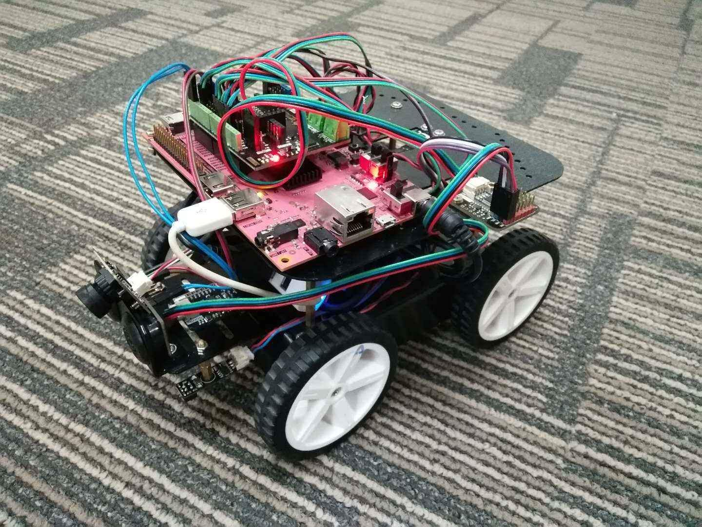

# Robot Car Development Platform for PYNQ

A self-driving robot car development kit for PYNQ-Z2. 

This repo contains all the development source including the overlay design and all the embedded projects.

[A release version](https://github.com/xupsh/PYNQ-Car) contains the pip install package for Robot Car Development Platform for PYNQ. It's only support PYNQ Z2 board.

# Based on
PYNQ : https://github.com/Xilinx/PYNQ
